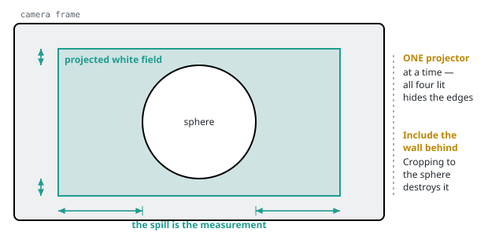
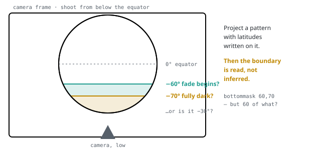
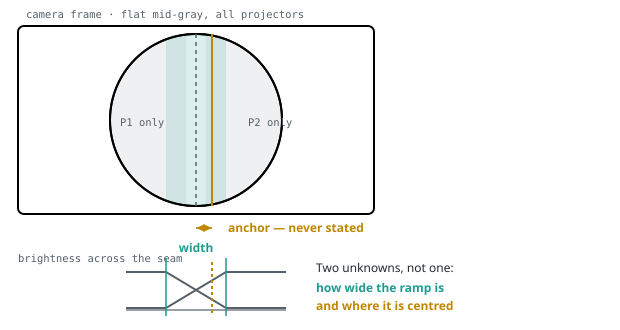
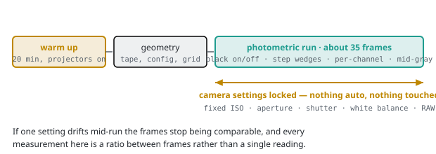
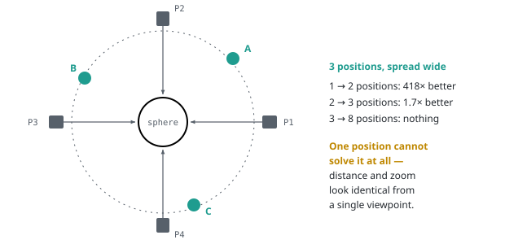

# Ground-truth visit — field card

What to measure at the sphere, in the order to measure it.

Everything here is ranked by what the measurement **decides**, not by what is easy
or by the order it appears in `PARAMETERS.md` §8. Items are numbered in **cut
order**: if time runs out, drop from the bottom of each list. Roughly 40 minutes
of tethered shooting plus 10 minutes of tape work.

Every ranking below comes from a measurement in this repository, cited inline.
Nothing here is a guess about what will matter.

> There is also a printable version of this card as an artifact. This file is the
> version-controlled copy, and it is the one that stays correct when an amendment
> is resolved.

---

## Two rules that outrank everything else on this card

**Warm the projectors 20 minutes before anything.** NOAA's alignment manual makes
this a procedural precondition, not advice (`docs/AMENDMENTS.md` A-23). The
photometric sequence is worthless if it starts cold, and it is 35 frames that
cannot be retaken later.

**Put the camera on a tripod.** Measured at **170×** — more than sensor noise,
ambient light and rolling shutter combined (`docs/EXPERIMENT-1.md`). A phone on a
tripod beats a better camera in a hand, and no amount of resolution recovers it,
because shake is a *bias* and resolution only averages down *noise*.

---

## Already settled — do not spend visit time on these

From the BenQ LK935 manual and datasheet, cross-checked against the manual's own
projection table (`docs/AMENDMENTS.md` A-35).

| Quantity | Value | What it settled |
| --- | --- | --- |
| Native resolution | 3840 × 2160 | Confirms the 7680×4320 X screen exactly (§3.4) |
| Throw ratio | 1.36 – 2.18 | §3.1's `T ≈ 3.0` is **impossible** — past the tele end |
| Zoom | 1.6× | Bounds `fov_h` to 25.84°–40.37°, class `CFG` |
| Lens shift range | ±60% V, ±23% H | The range §3.1 never stated |
| Projection offset | 0% | Image is centred on the axis at neutral shift |
| Light source | **Laser** | No lamps. §8 item 17's lamp hours are near-pointless |
| Display | 1-chip DMD | It is DLP, not LCD (§3.2's either/or) |
| Clear focus range | 2.88 – 9.60 m | The sphere's 0.79 m depth swing fits easily — §3.3's defocus concern does not survive |

---

## Part 1 · The three that unblock the build

These are worth more than everything else on this card put together.

The solver currently lands on an answer where all the errors cancel — every
projector wrong in a way that agrees with the others, so the photographs still
look right. Substituting the true value for any *single* piece makes the seam
metric **10× to 27× worse** (`docs/PHASE-1.md`, round 4's critique). Only outside
information breaks a compensating deformation, and this is the outside
information.

### 1. Photograph the projected image spilling past the silhouette

**Blocking · A-18 · worth 88–97% of the pose error**

The zoom ring is continuous, so knowing it is an LK935 *bounds* the field of view
without *pinning* it. Light that misses the sphere lands on whatever is behind
it, and **that overspill is what recovers the zoom setting.**

Two requirements the instruction does not carry on its own:

- **One projector at a time.** All four lit hides the rectangle's edges.
- **Include the wall behind.** A tight crop on the sphere is a photograph with
  the measurement cut off.

Also note the zoom ring position if it carries index marks.

### 2. Read the lens shift off each projector's on-screen menu, as deployed

**Blocking · A-12 · two minutes**

At this geometry **0.01 of shift is 0.172° of yaw** — shift and pointing are very
nearly the same parameter, and which side of a factor of twenty the rotation gate
lands on is decided entirely by an uncertainty the spec does not state. The
mechanical range is now known; what is missing is where these four are set.

### 3. Are all four zoom rings set the same?

**Blocking · A-33 · two minutes**

Check by eye, by ring position, or by comparing image widths. Decides whether
tying the four fields of view together is **free or costs 23.7 mm**. Tying them
is already measured at 1.59× on pose recovery (round 4); this says whether we are
entitled to.

---

## Part 2 · Geometry — tape, config, two photographs

About ten minutes. **A tape measure is sufficient and a laser distance meter is
not worth buying:** swept across a 30× range of instrument precision, pose error
moved **2%** (`docs/EXPERIMENT-1.md`). The floor reference only decides
`h_center`, and a tape already recovers it to **0.85 mm** — thirty times finer
than the one-inch step the documented procedure works in.

1. **Floor to each projector lens — all four, not one.** §8 item 1 says "each"
   and it matters: with one height reference the rig's tilt is unobservable and
   gets absorbed into the solution; with three or more non-collinear references
   it becomes genuinely measurable (A-09).
2. **Sphere centre to each projector lens.** Settles §2's documented conflict —
   the alignment manual says about 17 ft (5.18 m), the floor plan implies
   5.50–6.14 m, and they do not overlap. Both are within the LK935's reach, so
   this changes the zoom setting rather than the lens.
3. **Floor to the sphere's equator.** Their own manual measures to the equator,
   and on a sphere that is the same height as the centre.
4. **Copy the live config:** `gamma`, `bottommask`, `viewport`, and the X screen
   resolution (§8 items 3, 5). As deployed, which may differ from the documented
   defaults.
5. **Grid alignment pattern from a marked, measured position** (§8 item 4). Mark
   the spot on the floor and measure it — an unmeasured viewpoint makes the
   photograph qualitative.
6. **Read the polar mask boundary against a latitude-labelled pattern.**

`bottommask 60,70` is *inferred* to mean latitude, and that inference governs the
domain of the only gate with zero tolerance (A-02, A-10). If they are degrees
from the pole instead, the masked region starts at −30° and the protected area
roughly triples. **A pattern with latitudes drawn on it settles it in one frame.**

---

## Part 3 · Photometry, in cut order

Ranked by `docs/EXPERIMENT-3.md`, which swept twenty `ASSUME`-class constants
across their plausible ranges. Two of these disagree with §10's own prediction of
what matters, and the disagreements are the interesting part.

Camera on full manual throughout — see the protocol below.

### 1. Full black with projectors ON, then OFF — darkest room, read per channel

§8 items 8, 9. The black floor ranks **1st, 2nd and 4th** of everything
measurable. §8 already calls this pair the highest-value frames in the list; what
is new is that they must be read **per channel** rather than as a neutral, and
treated as one joint measurement with the ambient reading below (A-29).

### 2. Lux meter at the sphere surface, in the room's real operating light

§8 items 9, 16. Rank 3, and the other half of every black-uplift number. At one
corner made entirely of *stated* ranges — a leaky projector in a dark room — the
uplift gate comes within **8% of failing**. Whether it passes is mostly a
statement about the room (A-21).

### 3. Per-channel step wedge on *two* projectors, not one

§8 item 12. **The item most likely to be cut, and the one that must not be.** §8
phrases it as "repeat on a second projector if time allows" — treat that as
mandatory. It is the only frame that separates *per-channel* divergence from
*per-projector* divergence.

Gamma divergence produces a **9.4 ΔE2000** artifact where 1.0 is the classic
just-noticeable difference, and it is nearly invisible to every gate currently
scored — §7's chromaticity gate moves by 0.003 while it happens (A-15). Do not
drop it because the metrics look green.

### 4. Flat mid-gray, all projectors, darkest room — capture enough overlap to see *where* the crossfade sits

§8 item 13.

Blend width is worth **8×** in geometric tolerance and shape 1.6×
(`docs/EXPERIMENT-2.md`). The spec states the width and the shape but never the
**anchor** — the crossfade does not have to sit on the line where the two
footprints meet, and nothing says where it does sit (A-25). **Frame both edges of
the overlap in one shot**; a photograph tight on the seam gives the width and
loses the anchor.

### 5. Full red, green, blue on each projector alone — 12 frames

§8 items 10, 11. Per-channel gain. Same mechanism as gamma: large on the readings
that can see it, about 0.02 of a gate on the scored ones.

### 6. Ambient colour temperature

§8 item 16, same reading as the lux meter with a white card added.

### 7. Projector primaries / colour gamut — off the datasheet page

§8 item 2. Free, and every ΔE2000 in the project currently rests on a Rec.709
substitution because no document states the primaries (A-22).

### 8. Sphere reflectance against a reference card — *droppable*

Rank 15 of 20. Every §7 gate is a ratio that cancels it. Worth having for
absolute brightness; not worth visit time.

### 9. Specular lobe — *no frame needed*

Swept to zero and back across its whole range: 0.003 of a gate. §1 invites
setting `ρ_spec` to zero to test sensitivity; done, and it barely registers.

---

## Capture protocol

Geometry work sits between warm-up and the photometric run on purpose: it fills
the twenty minutes the projectors need, and it needs no fixed exposure. **Once
the photometric run starts, nothing on the camera may change until it ends.**

**Camera on full manual for the entire sequence.** Fixed ISO, aperture, shutter
and white balance. RAW only. If anything auto-adjusts between frames the whole
set is unusable, because every measurement here is a *ratio between frames*
rather than a single reading.

A phone is fine. Resolution stops paying above about 1280×960 on a tripod, and a
modern phone sensor is well past that (`docs/EXPERIMENT-1.md`).

### Where to stand

| positions | measured gain |
| --- | --- |
| 1 → 2 | **418×** |
| 2 → 3 | 1.7× |
| 3 → 8 | nothing detectable |

Spread the three widely rather than clustering them — the gain comes from seeing
the sphere from genuinely different angles, not from taking more photographs. A
single position is **degenerate, not merely worse**: from one viewpoint, distance
and zoom look identical. A fourth position buys nothing measurable, so spend that
time on the tripod and on marking the floor instead.

Also worth capturing: **the room itself and the projector mounts**, for
`validation/`. Plausibility only — never a metric, never a gate. Note the
provenance so it can be marked unverified until the owner says otherwise.

---

## If you only get thirty minutes

Warm up · **Part 1's three items** · four lens heights and four lens distances ·
**black on / black off** · one lux reading · the step wedge on two projectors.

That is all of Part 1, most of Part 2, and the top three of Part 3 — and it
decides every number currently blocking the build.

---

## The baseline this is trying to beat

NOAA's documented alignment procedure takes **1–2 hours for a first-time
operator** and 15 minutes to an hour for an experienced one, judged by eye with
no published numeric tolerance (A-23). That figure is the comparison any claim
about this solver has to make, and it belongs in the record rather than in
somebody's recollection.

---

*Item codes `A-02`…`A-35` are entries in [`AMENDMENTS.md`](AMENDMENTS.md); `§`
references are to [`PARAMETERS.md`](PARAMETERS.md). Rankings come from
[`EXPERIMENT-1.md`](EXPERIMENT-1.md) (camera positions),
[`EXPERIMENT-2.md`](EXPERIMENT-2.md) (blend) and
[`EXPERIMENT-3.md`](EXPERIMENT-3.md) (photometric sensitivity) — each measured
once and not iterated. Figures are in [`figures/`](figures/).*
